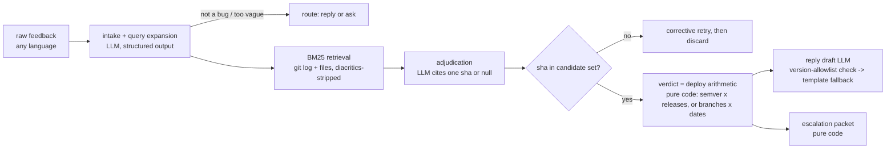

# Landed — design document

## 1. The problem

This month I triaged 31 pieces of user feedback for a mobile wellbeing app I
work on. The single most useful fact for answering almost every report was not
in any support tool: **most of the reported bugs were already fixed** — merged
weeks earlier — but the fixes hadn't reached the reporters, because app-store
review, staged rollouts, and users who simply don't update put weeks between
"merged to main" and "in this user's hands."

That gap creates a specific, recurring pain for whoever answers users at a
small team shipping mobile (or desktop, or anything with release lag):

- **Who hurts:** the support/product person triaging inbound feedback, and the
  engineer they interrupt. Support can't read git; engineering context-switches
  to answer "didn't we fix that?" several times a week.
- **What it costs:** either an engineer interruption per report, or the mushy
  "thanks, we'll look into it" — which, for a bug that's already fixed, is a
  worse answer than the truth and quietly erodes user trust. Duplicate tickets
  pile onto the tracker for things that are done.
- **Why an AI harness fits:** the evidence is scattered and unstructured
  (commit messages, release tags, rollout state), and the report is fuzzy
  natural language in the *user's* vocabulary and language — "se me borró lo
  que había contestado" has to match "flush runner state on AppState change."
  Bridging that gap needs a language model. But the verdict itself — *is the
  fix in a version this reporter has?* — must **not** come from a model; it's
  set-membership and version comparison, and getting it confidently wrong is
  the one unforgivable failure. That split — model for the fuzzy joins,
  deterministic code for the claim — is exactly what a harness is for.
- **Where it doesn't fit (honestly):** teams with disciplined fix-version
  labeling on a tracker plus single-branch instant deploys mostly don't have
  this problem — there, this is a SQL query. The tool earns its keep where
  the gap between "merged" and "in this user's hands" is structural and commit
  history is the only truthful record — release lag on mobile, or a
  pre-production branch on the web (§4 tells how a real web repo taught me
  the second case the hard way).

Existing "AI support" tools answer from knowledge bases and macros. I couldn't
find one that answers **relative to the reporter's build**, from the codebase
and release state, with the distinction that matters most in practice:
*already fixed — update* vs. *fixed — not in your hands yet*.

## 2. The end user and the interface

The user is a support or product person — non-technical, bilingual context
(our users write in Chilean Spanish and English), high volume, low tolerance
for friction. They don't want a chat conversation with an AI; they want a
**verdict and a next action** per item. So the interface is the shape their
work already has: an inbox.

- Left: the feedback queue (seeded from channels; paste works too). Each item
  gets a colored verdict chip once analyzed.
- Right: the original message, a live progress ticker while the pipeline runs
  ("Searched 32 changes — 12 possibly related"), then a verdict card in plain
  words with the evidence humanized ("2026-06-04 — 'breathing timer no longer
  restarts after switching apps' · packaged in v1.2.0 — in review, in stores
  ~2026-07-28"). No shas, no jargon.
- Below: an editable **reply draft in the reporter's language** with one-click
  copy — nothing is ever auto-sent — and, whenever a human is needed
  (regression / not fixed / uncertain / failure), a pre-built **engineering
  handoff** with symptoms, version, ruled-out candidates, and missing info, so
  the escalation that does happen arrives with context instead of a Slack ping.
- When the tool can't answer, it says so plainly and keeps the item. The
  failure modes are designed states, not blank screens.
- Not every inbox item is a report. A teammate pasting a direct question —
  *"is the PDF export bug fixed?"* — is detected at intake and answered as a
  **lookup**: same retrieval, same citation and confidence gates, but the
  output is an answer about the change history, not a filed bug with a
  drafted reply. Before the route existed, questions came back `not_a_bug` —
  technically true, humanly useless.
- The header always names what the verdicts are *about*: the connected repo,
  its deployment branches, and the product name — so "already fixed" can
  never quietly mean "fixed in some other codebase".

The verdict taxonomy is the product: `already_fixed` (update available),
`fix_coming` (merged / in review — with ETA when known), `regression`
(reporter's version should contain the fix — red, auto-escalated),
`not_fixed`, `uncertain` (candidate found, human confirms), `needs_info`
(exact questions to send, in the user's language), `not_a_bug` (feature
requests routed, not verdicted).

## 3. Architecture and the harness

Three LLM calls maximum per item (intake, adjudication, reply), each small and
schema-enforced at the API layer (the Responses API's `responses.parse` with a
Pydantic model; `store=false` on every call — user feedback is support data and
is not retained server-side). Everything load-bearing is deterministic:

- **The model never says "fixed."** It only links a symptom to a commit, with
  calibrated confidence. Whether that commit reached this reporter is computed
  from tag containment plus a release manifest (git says code was *cut*;
  the manifest says users *have it* — deliberately separate sources of truth).
- **Citations are verified.** A cited sha must be in the retrieved candidate
  set; one corrective retry, then the citation is discarded rather than
  trusted.
- **Confidence gates the claim.** ≥0.70 can claim a fix; 0.40–0.70 surfaces
  the candidate to a human (`uncertain`); below that it's `not_fixed`. The
  asymmetry is intentional: a false "already fixed" reaches an end user, a
  false abstain costs one human look.
- **Replies can't invent facts.** The drafter receives a facts object; a regex
  allowlist rejects any version string not in the verdict, retries once, then
  falls back to a deterministic bilingual template. A usable reply always
  exists.
- **Failure degrades, never guesses.** API errors (after SDK retries), refusals
  and schema failures all land in a `failed` state that keeps the item, shows a
  friendly message, and still produces an escalation packet.

**Two deploy models, one question.** The demo ships like an app-store product
(`tags` mode): "did it reach them" is tag containment × the release manifest,
against the reporter's version. A continuously-deployed product
(`LANDED_DEPLOY_MODEL=continuous`) has no versions to compare — merging *is*
shipping — so the same question is answered by **branches and dates**:
`LANDED_BRANCHES` names the deployment stages production-first; only the first
counts as "in users' hands" (`already_fixed`, with a two-day grace window
before a post-deploy report reads as `regression`), later stages read as
`fix_coming`, and branches not named never enter the corpus, so experimental
work can never be cited as a fix. Naming the stages is required rather than
defaulted; §4 is the story of why.

Retrieval is BM25 over commit subject+body+paths with a code-aware,
diacritics-stripping tokenizer. Cross-language matching (Spanish report ↔
English commits) is handled at *query* time: intake emits both user-vocabulary
and engineer-vocabulary search terms ("se reinicia el temporizador" →
"timer", "reset", "resume", "focus"). At this corpus scale that beats
maintaining an embedding index, and it's debuggable — you can read exactly why
a commit ranked.

## 4. How I know it works

`evals/cases.jsonl` holds 25 labeled cases: the 9 demo items plus paraphrases,
dialect variants ("se cierra al tiro"), odd version formats, vague reports, and
deliberate traps — a streak *timezone* fix that must not match a streak
*layout* complaint, and two regression cases where the same symptom+match must
flip the verdict because of the reporter's version. The runner reports accuracy,
per-class precision/recall, and the headline: **false-"fixed" rate** over all
fixed-claims, plus citation validity (structurally forced to 0).

Two honest layers to the numbers, kept separable on purpose — when a number
moves you want to know whether to look at the prompts or the plumbing:

- **Harness logic (no model, no key):** `scripts/author_fixtures.py` plays the
  model's role with hand-written realistic outputs and runs the *real* pipeline
  around them: 25/25 cases produce the gold verdict, 0 false-fixed, 0 invalid
  citations, and every target commit is retrieved into the candidate set. This
  pins the deterministic 80% of the system — routing, retrieval, guardrails,
  version arithmetic. Unit tests (`make test`) pin the same layer at finer
  grain; both run keyless in CI.
- **Live model, end to end:** `make record` runs every case against the live
  API, grading as it goes and recording every response as a replay fixture —
  so the keyless demo replays *real* model outputs, and `make eval-replay`
  reproduces the graded run bit-for-bit.

Live results (gpt-5.5, reasoning effort `medium` on adjudication, 2026-07-23):
**25/25 verdicts, false-"fixed" 0/12, invalid citations 0**, per-class
precision/recall 1.00 across all six verdict classes; ~10s median per item
(4–21s, one slow outlier at 72s).

The first live run also did exactly what an eval loop is for — it caught two
real defects no authored test had hit:

1. **A guardrail bug.** The model drafted "v1.1.0" (a *correct* version); the
   allowlist regex, anchored on `\b`, couldn't start a match between `v` and
   `1`, silently matched the inner `1.0`, and rejected a valid reply — costing
   a pointless retry. Fixed by consuming the optional `v` prefix; pinned with a
   regression unit test.
2. **A semantic wobble.** On no-match cases the model returned
   `match_sha: null, confidence: 0.9` — using confidence as "confidence in my
   answer" while the prompt defines it as "confidence in the match". Harmless
   (null short-circuits before any confidence gate) but incoherent data; one
   clarifying prompt line, re-recorded, now every null match reports 0.0.

The defect that mattered most came from neither layer. I pointed Landed at a
real production web app I work on — continuous deploys, no tags, three
long-lived branches (production / pre-production / experimental) — and asked
about a fix I knew had just merged. It answered **already fixed, 0.98
confidence**, and drafted a "just reload the page" reply. The fix was only on
pre-production: bare `git log` reads whatever `HEAD` points at, so the
evidence corpus had silently depended on the last `git checkout` — and the
exact failure this tool exists to prevent came out of my own harness. No
number of eval cases would have caught it: all 26 run against the demo repo,
where `HEAD` and the deployed branch coincide. The trial reshaped continuous
mode — stages required and explicit, only the live branch means "in users'
hands", unnamed branches excluded from evidence — and made misconfiguration
loud: a stage that doesn't exist fails at startup naming the ones that do,
and a stage order contradicting the direction commits travel draws a header
warning. That check compares branch-tip recency, not ahead/behind counts,
because I measured the trial repo first: production legitimately held eight
commits staging lacked (old drift), so counts would flag correct configs.
The coverage gap became its own test layer — git-backed tests over synthetic
multi-branch repos (`tests/test_indexer_git.py`), kept out of the otherwise
hermetic unit suite.

## 5. Tooling and tradeoffs

- **GPT-5.5 via the Responses API, reasoning effort tiered per stage.** The
  flagship for judgment quality on the call that matters — adjudication runs
  at `medium` reasoning effort (symptom↔fix discrimination is the one place
  extra reasoning pays); intake and drafting run at `low` for latency.
  `responses.parse` gives API-level schema enforcement instead of a hand-rolled
  parse-retry loop, and `store=false` keeps user feedback out of provider
  retention. My other projects already run on the OpenAI API, so keys and
  operational familiarity were on hand; nothing in the design is
  provider-specific — the model seam is one file (`harness/llm.py`), and the
  first commit shows the same contract working against Claude's structured
  outputs. At real triage volume I'd A/B `gpt-5.4-mini` on intake/drafting —
  the seam (`OPENAI_MODEL`) exists — but I didn't want to tune two models in a
  take-home. GPT-5 reasoning models don't accept sampling parameters, so
  determinism comes from prompts + validation.
- **BM25 + LLM query expansion over embeddings.** Right-sized for
  tens-to-thousands of commits, zero extra infra, inspectable failures. The
  cut line is real: at ~10k+ commits or multi-repo scope I'd add an embedding
  channel and fuse rankings. Deliberately not built now.
- **FastAPI + one vanilla-JS file.** No build step; `pip install` and run. SSE
  for honest progress (the stages shown are the stages running). React would
  add an install step and nothing else at this scope.
- **Synthetic demo repo, generated deterministically.** Controllable traps,
  stable shas for fixtures/evals, nothing proprietary shipped. The harness
  itself is repo-agnostic (`LANDED_REPO=...`).
- **Deliberately not built:** ticket-system ingestion (Zendesk/Intercom is an
  adapter, not the interesting part), auto-send (a human clicks copy — trust
  is the product), duplicate clustering across reports, "notify these users
  when the fix ships" (the natural v2 — the verdict object already contains
  everything needed), store-API integration for the release manifest.

## 6. Reflections

**Time spent:** about a focused day, roughly half on the harness/evals and
half on demo data, interface, and this write-up.

**Next with more time:** (1) grow the eval set from real (anonymized)
feedback until the numbers stop being flattering — 25 cases is enough to
catch harness bugs (it did), not enough to trust 25/25 as a ceiling — and A/B
per-stage model splits (`gpt-5.4-mini` on intake/drafting); (2) the
release-manifest adapter for App Store Connect/Play Console so `fix_coming`
ETAs are live truth; (3) close the loop — when support corrects a verdict,
that correction becomes a labeled eval case; (4) "notify on landed": message
the reporter when their fix actually ships.

**Least sure about:** retrieval recall on genuinely terse commit histories
("fix stuff") — query expansion can't rescue a corpus with no signal, and I'd
want the eval set to measure where that cliff is; whether `uncertain` occurs
at the right rate on live traffic — the confidence thresholds are set by
reasoning, not yet by data; and continuous mode's live-model behavior, which
rests on unit tests, the authored-output logic gate, and one real-repo trial —
it has no recorded eval cases of its own yet, and the stage-order check is a
tip-recency heuristic — a hotfix pushed straight to production flips it either
way (noise on a correct config, silence on an inverted one), which is why it
warns instead of refusing.
