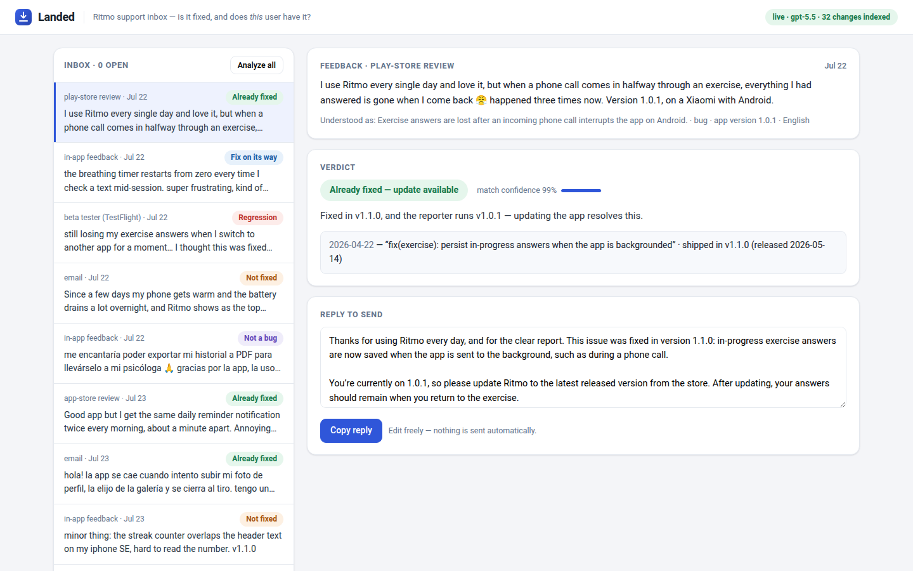

# Landed

**"Is this already fixed — and does the fix reach *this* user's version?"**

Landed is a support-inbox tool for teams that ship through app stores. Paste
(or receive) a piece of raw user feedback — any language, any shape — and get
back an **evidence-gated verdict** (*already fixed / fix on its way /
regression / not fixed / needs info*), a **ready-to-send reply in the
reporter's language**, and, when a human is needed, a **pre-built engineering
handoff** — without interrupting an engineer.



The trick is what it *doesn't* trust the model with: a language model bridges
fuzzy user vocabulary to engineer vocabulary ("everything I answered is gone"
→ `persist runner state on AppState change`), but whether that fix is in the
reporter's hands is **version arithmetic over git tags and a release
manifest — pure code**. The model never says "fixed."

See [DESIGN.md](DESIGN.md) for the problem thesis, architecture, and tradeoffs.

## Run it in 60 seconds (no API key)

The repo ships with **recorded gpt-5.5 outputs** for every demo item and eval
case, a deterministic demo product (**Ritmo**, a habit-tracking app with 32
commits and 4 releases), and 9 seeded feedback items:

```bash
make setup      # python3 -m venv .venv && pip install -r requirements.txt
make demo       # → http://localhost:8712 — click an item, or "Analyze all"
```

The demo repo is generated on first boot with fixed dates and authors, so
commit shas — and therefore the recorded fixtures — are stable across machines.

## Live mode

Put a key in `.env` at the repo root (it's gitignored) or export it:

```bash
echo 'OPENAI_API_KEY=sk-...' > .env
make demo       # header badge flips to "live · gpt-5.5"
```

Now the pipeline calls the model for real — including for feedback you paste
yourself. `OPENAI_MODEL` overrides the default (`gpt-5.5`). Calls go through
the Responses API with `store=false`; user feedback is not retained
server-side.

## Evals

```bash
make test          # unit tests for the deterministic core (no key needed)
make logic         # hand-authored model outputs through the real pipeline (no key)
make eval-replay   # grade the shipped recorded fixtures, strict (no key)
make record        # re-record every fixture live and grade end-to-end (~70 calls)
```

25 labeled cases: the 9 inbox items plus paraphrases, Spanish/Chilean dialect
variants, odd version formats, vague reports, and deliberate traps (a streak
*timezone* fix that must not match a streak *layout* complaint; two regression
cases where the reporter's version must flip the verdict). The headline metric
is the **false-"fixed" rate** — telling a user something is handled when it
isn't is the one failure the tool must not make.

Latest live run (gpt-5.5, 2026-07-23): **25/25 verdicts correct, 0/12
fixed-claims wrong, 0 invalid citations**, ~9s median per item. The first live
run also caught a real harness bug (a `v`-prefixed version misread by the
reply guardrail's regex) — kept as a unit test; the story is in
[DESIGN.md](DESIGN.md#4-how-i-know-it-works).

## Point it at your own repo

```bash
LANDED_REPO=/path/to/your/repo make demo
```

Without a `LANDED_RELEASES` manifest, every git tag counts as a released
version. Analyzing your own feedback requires live mode.

**If you deploy continuously** (a web app, no tags, no store review), set
`LANDED_DEPLOY_MODEL=continuous` and name your deployment branches, most
advanced first. Merging becomes shipping, so there is no version to compare and
no version to ask the reporter for; the same question — *did the fix reach this
person?* — is answered by branches and dates instead.

```bash
LANDED_REPO=/path/to/your/webapp \
LANDED_DEPLOY_MODEL=continuous \
LANDED_BRANCHES=main,staging make demo
```

`LANDED_BRANCHES` is required in continuous mode, and the requirement is the
point: without it the corpus is whatever `HEAD` was left pointing at, so a fix
living only on a feature branch reads as *already fixed* — a confident false
claim, sent to a user. With stages named, the first branch is what users are
running (`already_fixed`, or `regression` when the fix predates the report),
anything further back is merged but not in their hands (`fix_coming`), and work
on unnamed branches never enters the corpus at all, so it cannot be cited.

## What's real vs. stubbed

**Real:** the whole harness — intake normalization + bilingual query expansion
(structured outputs), BM25 retrieval over git history, adjudication with
citation validation and a corrective retry, deterministic version arithmetic,
reply drafting with a version-allowlist guardrail and a templated safe
fallback, escalation packet generation, SSE progress streaming, the eval
runner, unit tests, CI, and graceful degradation on every failure path.

**Stubbed / simulated:**
- The product under support (Ritmo) is synthetic — generated git history plus a
  hand-written release manifest standing in for App Store / Play Console APIs.
- Feedback arrives by seed file or paste — no Zendesk/Intercom/store-review
  ingestion.
- The "Copy reply" button is the delivery mechanism; nothing is auto-sent (by
  design, not just scope).
- Inbox state is in-memory; restart re-seeds it.

**Known limitations:** single-repo evidence only (no PR/issue-tracker corpus);
BM25 needs the LLM's query expansion to bridge user↔dev vocabulary — at much
larger corpus sizes a hybrid with embeddings would be the next step; verdicts
trust the release manifest, which in production must come from store APIs, not
a file; duplicate/known-issue clustering across reports is out of scope.

## Repo layout

```
harness/          the pipeline: schemas, indexer (git+BM25), llm seam (Responses API),
                  prompts, pipeline (guardrails + verdict logic), FastAPI server, evals
web/index.html    the support inbox (vanilla JS, no build step)
demo/             generator for the deterministic demo repo + releases + seed feedback
evals/            25 labeled cases (gold verdicts + fix versions) + last run results
fixtures/replay/  recorded gpt-5.5 outputs — keyless runs replay these
scripts/          author_fixtures: the harness-logic gate (model played by hand)
tests/            unit tests for version arithmetic, guardrails, fallbacks
```
